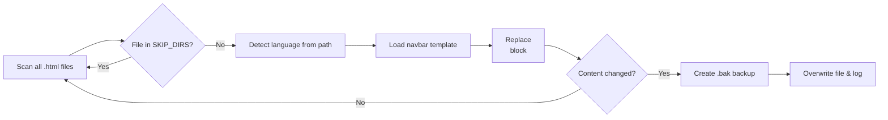

# 🌐 Multi‑Language Navbar Injector

[](https://www.python.org/)
[](LICENSE)
[](https://github.com/psf/black)

> A zero‑dependency Python script that automatically replaces the `<header>` section in static HTML files with a language‑specific navigation bar.

Perfect for multilingual static sites (Jekyll, Hugo, plain HTML) where each language sits in its own directory and you need a consistent, maintainable header across dozens or hundreds of pages.

---

## ✨ Features

- 🌍 **Language detection** – determines the page language from the file path (supports `en`, `ar`, `de`, `zh`, easily extendable).
- 📁 **Directory‑based exclusion** – skips folders like `.git`, `node_modules`, or `tools` so only content files are touched.
- 🔄 **Safe updates** – creates a `.bak` backup of each file before overwriting it.
- ⚡ **Simple, fast, standalone** – uses only the Python standard library; no `pip install` needed.
- 📋 **Clear reporting** – prints the name of every updated file and a final summary.

---

## 📦 Requirements

- **Python 3.6** or higher (standard library only, no external packages)

---

## 🛠 Installation

1. **Clone the repository**

   ```bash
   git clone https://github.com/yourusername/navbar-injector.git
   cd navbar-injector
   ```

2. **No further installation needed** – just run the script directly.


## 📂 Directory Structure (expected)

The script expects your project to follow a layout similar to this:

```
your-site/
├── en/                  # English pages (default language)
├── ar/                  # Arabic pages
├── de/                  # German pages
├── zh/                  # Chinese pages
├── tools/
│   └── navbars/
│       ├── navbar-en.html
│       ├── navbar-ar.html
│       ├── navbar-de.html
│       └── navbar-zh.html
├── script.py            # this script (place it inside tools/ or at root)
└── ... other directories ...
```

- The script looks for language folders (`ar`, `de`, `zh`) anywhere in the file path; if none match, it assumes English.
- Navbar templates are loaded from `tools/navbars/` relative to the repository root.

---

## 🚀 Usage

Run the script from the **repository root**:

```bash
python tools/navbar_injector.py
```

or, if you placed the script at the root:

```bash
python navbar_injector.py
```

**Example output**:

```
Updated: en/about.html
Updated: en/contact.html
Updated: ar/about.html
Updated: de/team.html

==================================================
Files updated: 4
==================================================
```

The script will:

1. Scan for every `.html` file in the project.
2. Detect its language from the path.
3. Read the appropriate navbar template.
4. Replace everything between `<header` and `</header>` with the template.
5. Save the original file as a `.bak` backup on first modification.

---

## ⚙️ How It Works



- **Language detection** (`get_language`): checks the path parts for `ar`, `de`, `zh`; defaults to `en`.
- **Navbar loading** (`load_navbar`): reads the template file, raising clear errors if missing or empty.
- **Header replacement** (`replace_header`): finds the first `<header ...>...</header>` block and substitutes the entire tag and its contents with the new navbar.
- **Backup creation**: the first time a file is updated, a copy with the extension `.html.bak` is created (e.g., `about.html.bak`). Subsequent runs do not overwrite existing backups.

---

## 🧪 Testing

Manually test by creating a small sample site structure with a few dummy HTML files and a `tools/navbars/` folder. Run the script and verify:

- Correct navbar injected per language.
- Backup files appear.
- Files not under a recognised language get the English navbar.
- Excluded directories are ignored.

*(For automated testing you can add sample data and use `pytest` to compare before/after states.)*

---

## 🤝 Contributing

Contributions are welcome! To propose changes:

1. Fork the repository.
2. Create a feature branch (`git checkout -b feature/new-language`).
3. Commit your changes.
4. Push to the branch and open a Pull Request.

Please keep the code PEP 8 compliant and avoid external dependencies.

---

## 📝 License

This project is licensed under the **MIT License** – see the [LICENSE](LICENSE) file for details.

---

## 👤 Author

**Your Name**  
[GitHub](https://github.com/4MaxR) • [LinkedIn](www.linkedin.com/in/mustafa-al-rouby-20218b171)

---

*If this script saved you hours of manual header updates, consider giving the repository a ⭐!*
